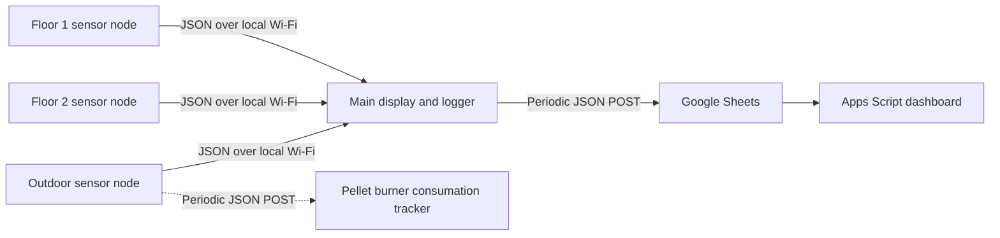

# Home Temperature Monitoring

An ESP32-based home monitoring project that measures temperatures across multiple locations, displays readings on-device, and sends selected sensor data to a Google Sheets-backed dashboard.

## What It Does

- Reads indoor temperature and humidity on the floor and outdoor sensor nodes.
- Reads hot-water and cold-water temperatures, indoor humidity, and pressure on the main display node.
- Serves temperature and humidity readings from sensor nodes as JSON over the local network.
- Fetches readings from the sensor nodes and posts periodic measurements to Google Sheets.
- Displays live readings on small OLED and TFT displays, with OTA firmware updates enabled.
- Provides a Google Apps Script dashboard with current readings and historical charts.

## System Overview

The sensor nodes expose a `/temp` endpoint returning `temperature` and `humidity`. The main node polls those endpoints and combines their readings with its local sensors. The outdoor sketch also contains an optional periodic upload using a `GET` request with a `temp` query parameter; this needs a matching Apps Script handler if used.

## Repository Layout

| Path            | Purpose                                                                 |
| --------------- | ----------------------------------------------------------------------- |
| `temp-f1/`      | Floor 1 ESP32 sensor node with AHT20 and SSD1306 OLED                   |
| `temp-f2/`      | Floor 2 ESP32 sensor node with AHT20 and SSD1306 OLED                   |
| `temp-out/`     | Outdoor ESP32 sensor node with AHT20, SSD1306 OLED, and optional upload |
| `water_temp/`   | Main display/logger with DS18B20 probes, AHT20, BMP280, and ST7789 TFT  |
| `temp-scripts/` | Google Apps Script data handler and dashboard page                      |

## Hardware

The firmware uses ESP32-compatible boards. Confirm that your exact board supports the pins and libraries used in each sketch before wiring; pin assignments and per-sensor temperature offsets are defined in the `.ino` files.

The project uses these sensors and displays:

- 3x AHT20 temperature and humidity sensors
- 3x SSD1306 128x32 OLED displays on the smaller nodes
- 2x DS18B20 probes for hot- and cold-water temperatures
- BMP280 pressure sensor
- ST7789 170x320 TFT display on the main node

## Firmware Setup

1. Install the ESP32 board support package in Arduino IDE and select the board matching each device.
2. Install the required libraries: Adafruit GFX, Adafruit SSD1306, Adafruit AHTX0, Adafruit ST7789, Adafruit BMP280, OneWire, and DallasTemperature. Install dependencies requested by the library manager as well.
3. In each firmware folder, copy `secrets.example.h` to `secrets.h` and enter that device's Wi-Fi credentials and a unique OTA password. The `secrets.h` files are ignored by Git.
4. For `temp-out`, set `SHEETS_URL` only if you have deployed an Apps Script endpoint that accepts its `GET ?temp=...` request.
5. For `water_temp`, set the three sensor URLs to the `/temp` endpoints of the floor and outdoor nodes, and set `SHEETS_URL` to your Apps Script web app deployment.
6. Open the matching `.ino` sketch in Arduino IDE, build, and upload it to the corresponding board.

## Google Sheets Dashboard

The files in `temp-scripts/` are intended for a Google Apps Script project:

1. Create a Google Sheet and an Apps Script project associated with it.
2. Add `code.js` as the Apps Script source and `index.html` as an HTML file named `index`.
3. Ensure the spreadsheet has a sheet named `Sheet1`; the script appends timestamps and sensor readings there.
4. Deploy the script as a web app and configure access deliberately. Put the resulting URL in the local `water_temp/secrets.h` file, not in the repository.

The included `doPost` handler accepts the JSON payload sent by `water_temp`. The `temp-out` firmware uses a different `GET` upload contract; add a separate handler for that contract if you want to enable its upload. The dashboard reads recent rows from `Sheet1`.

## Security Before Publishing

- Keep `secrets.h` files untracked. Review `git status` and the staged diff before every public commit.
- Do not commit Wi-Fi credentials, OTA passwords, deployment URLs, private network addresses, or personal dashboard data.
- Use a dedicated test spreadsheet and deployment for public demonstrations. Anyone who can call a public write endpoint may be able to add data to its spreadsheet.
- Rotate credentials or redeploy endpoints that were previously exposed. Removing a value from the latest source does not remove it from an existing deployment or any commit that already contains it.
- The device `/temp` endpoints have no authentication and are intended only for a trusted local network.

## Portfolio Notes

This project demonstrates embedded sensor integration, Wi-Fi-connected ESP32 firmware, a small JSON HTTP API, periodic data collection, OTA updates, and a lightweight Apps Script dashboard. Add photos of the assembled hardware and a screenshot of the dashboard before using the repository as a CV project; avoid images that reveal private network or account details.

No license is included yet. Public visibility on GitHub does not by itself grant reuse rights; add a license if you want others to use or modify the code.
